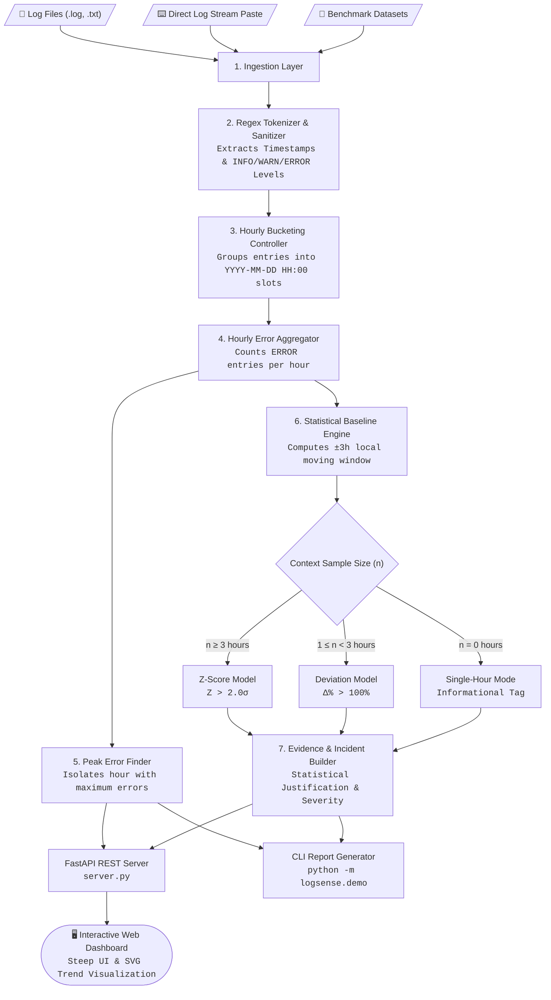
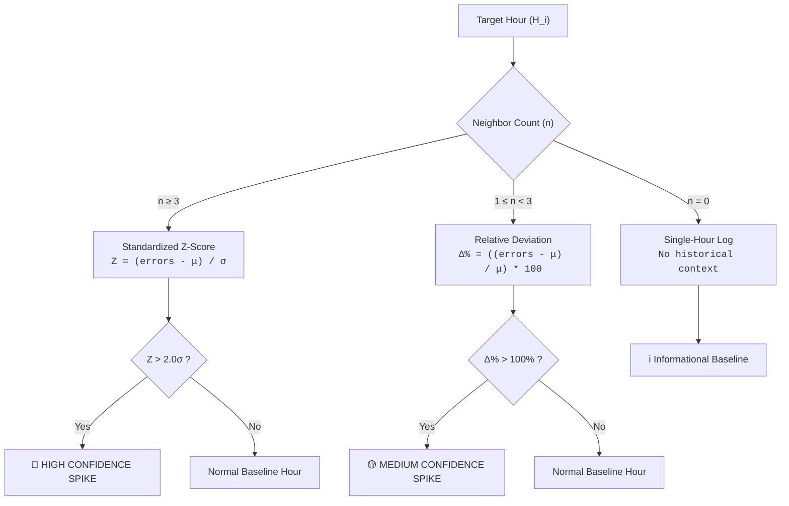

<p align="center">
  
</p>

<h1 align="center">LogSense</h1>

<p align="center">
  <strong>From raw logs to explainable error trends.</strong>
</p>

<p align="center">
  
  
  
  
  
</p>

LogSense is an automated **Error Trend Detector** that converts unstructured timestamped server logs into granular hourly analytics, identifies peak error periods, and statistically flags sudden error surges by comparing activity against dynamic rolling baselines with explicitly defined thresholds.

---

## 📑 Table of Contents

- [Overview & Problem Context](#-overview--problem-context)
- [System Architecture](#-system-architecture)
- [Analytical & Statistical Engine](#-analytical--statistical-engine)
- [Key Features](#-key-features)
- [Application Interfaces](#-application-interfaces)
  - [1. Web Interface (FastAPI + SPA)](#1-web-interface-fastapi--spa)
  - [2. Interactive CLI Terminal Tool](#2-interactive-cli-terminal-tool)
- [Project Structure](#-project-structure)
- [Getting Started](#-getting-started)
- [Automated Test Suite (78 Tests)](#-automated-test-suite-78-tests)
- [Benchmark Sample Datasets](#-benchmark-sample-datasets)
- [Deployment](#-deployment)

---

## 🎯 Overview & Problem Context

In distributed environments, counting the total number of errors is rarely actionable. Operating teams need to know **when errors suddenly surge** relative to normal baseline traffic so anomalies can be isolated before they cascade into system-wide outages.

### What LogSense Solves:
1. **Timestamped Parsing**: Ingests canonical server log streams with `INFO`, `WARNING`, and `ERROR` severity levels.
2. **Hourly Bucketing**: Groups records into contiguous hourly time slots (`YYYY-MM-DD HH:00`).
3. **Error Volume Aggregation**: Calculates discrete hourly error counts and log throughput.
4. **Peak Error Period Identification**: Isolates the exact hour with the highest error frequency.
5. **Dynamic Spike Detection**: Replaces static, hardcoded rules with self-adjusting local moving baselines.
6. **Transparent Statistical Evidence**: Explains *why* a spike was flagged by exposing sample sizes, local averages, percentage deviations, and standardized Z-scores.

---

## 🏗️ System Architecture



---

## 🧠 Analytical & Statistical Engine

Static thresholds (such as `errors > 10`) fail because baseline traffic varies across services and time of day. LogSense implements an adaptive neighborhood analysis.

### 1. Symmetric Moving Baseline Window
For any target hour $H_i$, LogSense defines its local baseline using the available neighboring hours within a $\pm 3$-hour radius (up to 6 neighboring hours):

$$\text{Neighborhood}(H_i) = \{H_{i-3}, H_{i-2}, H_{i-1}, H_{i+1}, H_{i+2}, H_{i+3}\}$$

Let $n$ be the number of valid neighbor observations. The baseline mean ($\mu$) and population standard deviation ($\sigma$) are calculated as:

$$\mu = \frac{1}{n} \sum_{j \in \text{Neighborhood}} \text{errors}(H_j)$$

$$\sigma = \sqrt{\frac{1}{n} \sum_{j \in \text{Neighborhood}} (\text{errors}(H_j) - \mu)^2}$$

### 2. Multi-Tiered Statistical Decision Model



### 3. Edge-Case Math Handling
- **Zero-Baseline Neighborhood ($\mu = 0$)**: When surrounding hours have zero errors, any non-zero error count ($\text{errors} > 0$) is flagged as a sudden surge with $\Delta\% = \infty$ to avoid division-by-zero errors.
- **Zero Variance ($\sigma = 0$)**: When neighbor error counts are identical (e.g. `[1, 1, 1]`), standard deviation defaults to safe boundary evaluation ($Z = \infty$ if $\text{errors} > \mu$, else $0.0$).
- **Non-Spike Normalization**: If error counts remain within normal variance ($Z \le 2.0$ or $\Delta\% \le 100\%$), the hour is tagged as `Normal`.

---

## ✨ Key Features

- 📊 **Hour-Wise Error Breakdown**: Granular hourly error volumes and total log line throughput.
- 📈 **Peak Error Hour**: Identifies and highlights the hour with maximum error concentration.
- 🔴 **Sudden Spike Alerts**: Clear visual and textual alerts for anomalous hourly jumps.
- 🔍 **Transparent Statistical Explanations**: "Why was this flagged?" drawer detailing exact mathematical inputs ($\mu$, $\sigma$, $Z$, sample size).
- 🏷️ **Domain Classification**: Automatic categorization of underlying error patterns (Database, Auth, API, Network) derived exclusively from `ERROR`-level entries.
- 📁 **Multi-Channel Ingestion**: Drag-and-drop file upload, direct text stream editor, preset test data loader, or live stream simulation.
- 🎨 **Steep Editorial UX**: Achromatic canvas, `Source Serif 4` typography, pill buttons, floating artifact cards, and dark/light mode.

---

## 🖥️ Application Interfaces

LogSense provides two complete interfaces: a modern web dashboard and a scriptable CLI.

### 1. Web Interface (FastAPI + SPA)
- **Staggered Letter Emergence**: Typographic intro animation with custom geometric brand emblem.
- **Two-Stage Directional Transitions**: Smooth exit blur/shrink $\to$ enter spring slide between Landing, Workbench, and Result views.
- **Rolling Metric Counters**: Smooth cubic deceleration counters for Total Logs, Total Errors, and Spikes.
- **Wave Bar SVG Chart**: Staggered upward bar rise animation with pulsing spike indicators.

### 2. Interactive CLI Terminal Tool
LogSense includes a standalone CLI terminal report generator located at `logsense/demo.py` and `logsense/report.py`.

Run the CLI on any log dataset:
```bash
python -m logsense.demo
```

CLI Report Output:
```text
============================================================
  LOGSENSE -- Log Incident Analysis Report
============================================================

HOUR-WISE ERROR BREAKDOWN
------------------------------------------------------------
Hour                    Total  Errors  Warnings
------------------------------------------------------------
2026-08-16 11:00            4       1         1
2026-08-16 12:00            4       2         1
2026-08-16 13:00            5       2         1
2026-08-16 14:00            5       3         0
2026-08-16 15:00           35      35         0
2026-08-16 16:00            5       2         1
2026-08-16 17:00            4       2         0
2026-08-16 18:00            1       0         0

PEAK ERROR HOUR
------------------------------------------------------------
  2026-08-16 15:00  (35 errors)

SPIKE ALERTS
------------------------------------------------------------
  [!] SPIKE: 2026-08-16 15:00
    Severity   : Critical
    Confidence : HIGH
    Errors     : 35
    Baseline   : 1.8
    Deviation  : 1809.1%
    Z-score    : 36.95

============================================================
```

---

## 📁 Project Structure

```text
LogSense/
├── logsense/                     # Core analytical Python package
│   ├── __init__.py               # Package public API exports
│   ├── parser.py                 # Timestamp regex tokenizer (INFO, WARNING, ERROR)
│   ├── bucketing.py              # Hourly slot grouping & count aggregator
│   ├── analysis.py               # Peak hour & dynamic moving baseline spike detector
│   ├── incident.py               # Incident summary cards & statistical evidence builder
│   ├── report.py                 # Plain-text ASCII report generator
│   ├── patterns.py               # Failure-domain keyword pattern analyzer
│   └── demo.py                   # Terminal interactive CLI demo runner
│
├── static/                       # Production single-page web application
│   ├── index.html                # Monolithic SPA (HTML5, Vanilla CSS3, ES6 JavaScript)
│   ├── favicon.ico               # Multi-size ICO favicon
│   ├── favicon.png               # PNG favicon
│   └── assets/
│       ├── logo.png              # Geometric faceted emblem
│       └── logo_transparent.png  # Transparent brand mark
│
├── test_data/                    # Synthetic validation datasets
│   ├── test_logs.txt             # Primary benchmark spike dataset
│   ├── sample_clean_spike.log    # Isolated single spike dataset (Hour 15)
│   ├── sample_multi_spike.log    # Multi-spike dataset across separate hours
│   ├── sample_no_spike.log       # Steady baseline traffic (no anomalies)
│   ├── sample_tiny.log           # 2-hour dataset for limited-history validation
│   ├── sample_malformed.log      # Corrupted/unparseable log lines
│   └── sample_empty.log          # Zero-byte empty file edge case
│
├── tests/                        # Automated PyTest test suite (78 tests)
│   ├── conftest.py               # Test fixtures and dataset loaders
│   ├── test_parser.py            # Unit tests: parsing & sanitization
│   ├── test_bucketing.py         # Unit tests: hourly grouping logic
│   ├── test_analysis.py          # Unit tests: statistical baseline & peak math
│   ├── test_incident.py          # Unit tests: incident cards & evidence panels
│   ├── test_report.py            # Unit tests: report text formatting
│   ├── test_patterns.py          # Unit tests: keyword pattern classifiers
│   ├── test_api.py               # Integration tests: FastAPI endpoints
│   ├── test_edge_cases.py        # 9 Edge-case stress tests
│   └── test_integration.py       # Full end-to-end pipeline integration tests
│
├── server.py                     # FastAPI REST API & static asset server
├── requirements.txt              # Production Python dependencies
├── Dockerfile                    # Production container image configuration
├── render.yaml                   # 1-click cloud deployment blueprint
├── Procfile                      # Process declaration for cloud platforms
├── .env.example                  # Environment configuration template
├── LICENSE                       # MIT Open Source License
├── .gitignore                    # Git tracking rules
└── README.md                     # Comprehensive system documentation
```

---

## 🚀 Getting Started

### Prerequisites
- **Python 3.10** or higher
- **pip** package manager

### 1. Installation
```bash
git clone https://github.com/your-username/LogSense.git
cd LogSense

# Create and activate virtual environment
python -m venv venv
# On Windows:
venv\Scripts\activate
# On macOS/Linux:
source venv/bin/activate

# Install dependencies
pip install -r requirements.txt
```

### 2. Run the Web Server
```bash
python server.py
```
Open **[http://127.0.0.1:8000](http://127.0.0.1:8000)** in your browser.

---

## 🧪 Automated Test Suite (78 Tests)

LogSense includes an exhaustive PyTest suite with **78 tests (100% passing)** covering all layers of the system.

```bash
pytest tests/ -v
```

### Test Suite Breakdown:

| Test Module | Tests | Focus Area |
|---|---|---|
| [`test_parser.py`](file:///c:/coding/LogSense/tests/test_parser.py) | 10 | Valid log levels (`INFO`, `WARNING`, `ERROR`), whitespace tolerance, corrupted line recovery. |
| [`test_bucketing.py`](file:///c:/coding/LogSense/tests/test_bucketing.py) | 4 | Hourly grouping, chronological key sorting, message collection integrity. |
| [`test_analysis.py`](file:///c:/coding/LogSense/tests/test_analysis.py) | 13 | Peak hour identification, high/medium/low confidence Z-score math, non-spike baseline verification. |
| [`test_incident.py`](file:///c:/coding/LogSense/tests/test_incident.py) | 6 | Incident card construction, ERROR-only message filtering, severity assignments, evidence panel explanations. |
| [`test_patterns.py`](file:///c:/coding/LogSense/tests/test_patterns.py) | 8 | Domain keyword matching (Database, Auth, API, Network), case-insensitivity, fallbacks. |
| [`test_report.py`](file:///c:/coding/LogSense/tests/test_report.py) | 6 | CLI summary formatting, peak hour string outputs, empty data handling. |
| [`test_api.py`](file:///c:/coding/LogSense/tests/test_api.py) | 8 | FastAPI `/analyze` and `/analyze/upload` routes, input validation, 400/413 error responses. |
| [`test_edge_cases.py`](file:///c:/coding/LogSense/tests/test_edge_cases.py) | 18 | Empty files, single-line logs, all-ERROR logs, all-INFO logs, out-of-order timestamps, multi-day midnight rollover, 10KB giant log lines, huge error volume math. |
| [`test_integration.py`](file:///c:/coding/LogSense/tests/test_integration.py) | 5 | Full end-to-end pipeline execution from raw text to final report on clean, multi-spike, normal, tiny, and malformed files. |

**Total:** `78 passed in 0.55s`

---

## 📊 Benchmark Sample Datasets

All datasets in `test_data/` are synthetic and deterministic:

- **`test_logs.txt`**: Benchmark dataset with normal traffic from 11:00 to 14:00, a massive spike at 15:00 (47 errors), and return to normal at 16:00.
- **`sample_clean_spike.log`**: Isolated database connection pool exhaustion spike at Hour 15.
- **`sample_multi_spike.log`**: Dual-spike dataset testing multiple incident windows across distinct hours.
- **`sample_no_spike.log`**: Uniform error distribution across 5 hours testing false-positive rejection.
- **`sample_tiny.log`**: 2-hour mini-dataset testing limited-history deviation fallback.
- **`sample_malformed.log`**: Mixed valid entries and garbage strings testing parser resilience.

---

## ☁️ Deployment

LogSense is ready for one-click cloud deployment:

### 1. Render Deployment
1. Connect this repository to **Render**.
2. Render will automatically detect [`render.yaml`](file:///c:/coding/LogSense/render.yaml) and deploy the web service on the free tier.

### 2. Docker / Container Platforms (Railway, Fly.io, Google Cloud Run)
Build and run the container locally or in the cloud:
```bash
docker build -t logsense .
docker run -p 8000:8000 logsense
```

---

## 📄 License

This project is open-source and available under the [MIT License](file:///c:/coding/LogSense/LICENSE).
